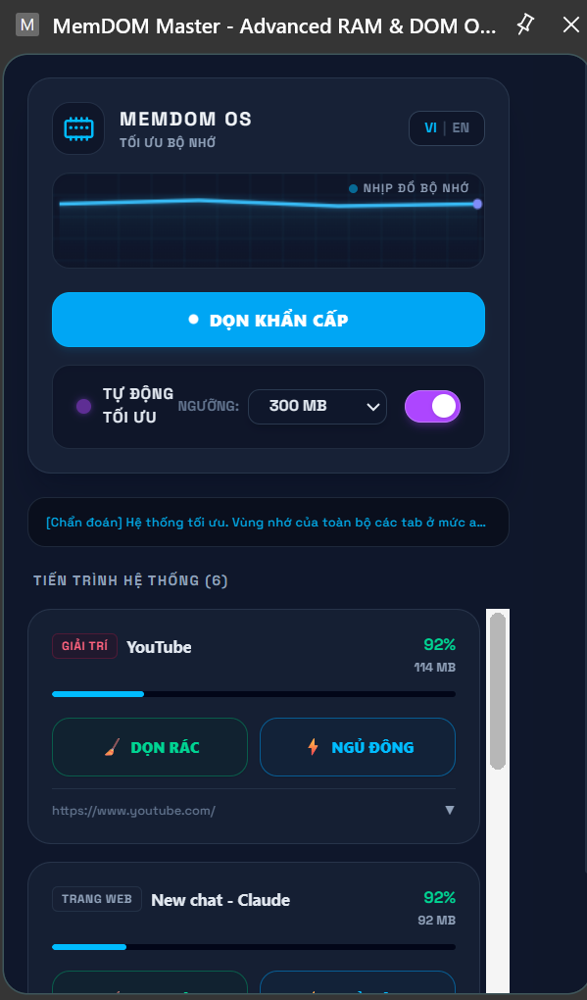

</p>
<p align="center">
  <h1 align="center">⚡ MemDOM Master OS</h1>
  <p align="center"><b>Advanced Realtime RAM &amp; DOM Tree Optimizer for Chrome Power Users</b></p>
</p>

<p align="center">
  <a href="https://github.com/gbao86/mem-dom-master">
    
  </a>
  
  
  
</p>

<p align="center">
  
  
  
  
</p>

<p align="center">
  <a href="https://github.com/gbao86/mem-dom-master">
    
  </a>
  
  
  
</p>

---

## 🐱 The Developer Cat Approves

<p align="center">
  
</p>

<p align="center">
  
</p>

---

## 🖥️ Dashboard Preview

<p align="center">
  
</p>

---

## 🚀 Key Features

> MemDOM Master OS delivers surgical-grade memory optimization techniques packed into a beautiful **Nordic/Slate Dark** telemetry control HUD.

<details>
<summary>🧹 <b>Active Heap Purging (Force V8 GC)</b></summary>
<br/>
Forces Chromium's V8 engine to execute immediate garbage collection on active tab runtimes — reclaiming unused memory blocks without reloading your workspace.
</details>

<details>
<summary>⚡ <b>Deep DOM Compression (Gzip DOM Standby Screen)</b></summary>
<br/>
Minimizes inactive tabs down to a tiny static footprint. Extracts the entire HTML DOM structure, compresses it using the native <code>CompressionStream</code> (Gzip) algorithm, caches dynamic form input fields, unloads all active script threads, and serves a beautiful standby screen.
</details>

<details>
<summary>💤 <b>True Background Auto-Pilot</b></summary>
<br/>
Runs silently in the background via alarms and intervals — even when the Dashboard UI is closed. Automatically triggers deep hibernation whenever a tab's memory usage meets or exceeds your custom-configured RAM threshold.
</details>

<details>
<summary>⏱️ <b>5-Minute Grace Period</b></summary>
<br/>
When you explicitly wake up an auto-hibernated tab, it enters a <b>5-minute grace period</b> where Auto-Pilot ignores it. If the tab still exceeds your memory threshold, a sleek notification banner warns you that auto-hibernation will resume in 5 minutes.
</details>

<details>
<summary>🗺️ <b>Realtime Memory Defragmentation Map</b></summary>
<br/>
Visualizes your page DOM node density and V8 heap state in an interactive 10×10 telemetry grid showing <b>Stable</b>, <b>Interactive</b>, <b>Leaking/Heavy</b>, <b>Compressed</b>, and <b>Free</b> memory blocks.
</details>

---

## 🛠️ Installation & Setup

```bash
# 1. Clone the repository
git clone https://github.com/gbao86/mem-dom-master.git

# 2. Install dependencies
cd mem-dom-master
npm install

# 3. Build the production bundle
npm run build
```

Then load the extension in Chrome:

1. Open `chrome://extensions/`
2. Enable **Developer mode** (top-right toggle)
3. Click **Load unpacked** → select the generated `dist/` folder

---

## 📝 Changelog

### [v0.0.1] — 2026-06-09

<details>
<summary>🆕 <b>View changes</b></summary>

- **True Background Auto-Pilot** — Relocated auto-pilot checking loop to the background service worker using alarms and intervals to keep optimization active when the dashboard popup is closed.
- **Custom RAM Threshold** — Added a custom select selector (MB/GB) and text-input box allowing users to specify a customized RAM threshold for the Auto-Pilot trigger.
- **5-Minute Grace Period** — Waking up an auto-hibernated tab temporarily registers it in a 5-minute grace period cache.
- **Webpage Warning Banners** — Injected a floating warning toast at the top-right of webpages if they remain above the memory threshold during the grace period.
- **Optimized UI Button Controls** — Enlarged the dashboard control buttons (`DỌN RÁC` and `NGỦ ĐÔNG` / `WAKE UP`) directly on the tab cards for a touch-friendly click experience.
- **Telemetry Fixes** — Discarded tabs now properly report exactly `0 MB` of memory and `0` DOM nodes/depth on the HUD.
- **Hardware RAM Icon** — Replaced the spinning radar orb with a hardware RAM chip SVG logo to remove generic AI assistant styling.

</details>

---

## 👤 Author

<p align="center">
  <b>Trịnh Gia Bảo</b> · <a href="https://github.com/gbao86">@gbao86</a> · <a href="mailto:tiktokthu10@gmail.com">tiktokthu10@gmail.com</a>
</p>

<p align="center">
  
</p>
